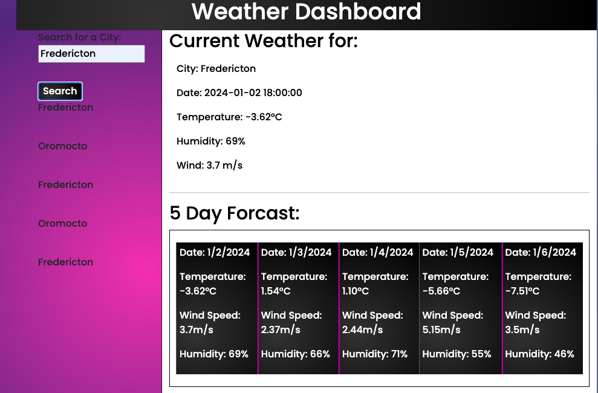

# Weather-Dashboard

A simple weather application that displays the current weather and 5 day forecast. This application also stores users prior searches.

## Upcoming Iterations

n/a

## Image of Weather Dashboard

## Repo:

https://github.com/fswDevSteph/Weather-Dashboard

## Installation instructions:

N/A

## Contributers

Tutors and Class assitance personal.
Names unknown.

## Known Issues:

N/A

## About Developer:

Stephanie Perroni is a full stack software development student who hopes to make meaningful and positively impactful contributions in the software development space.
